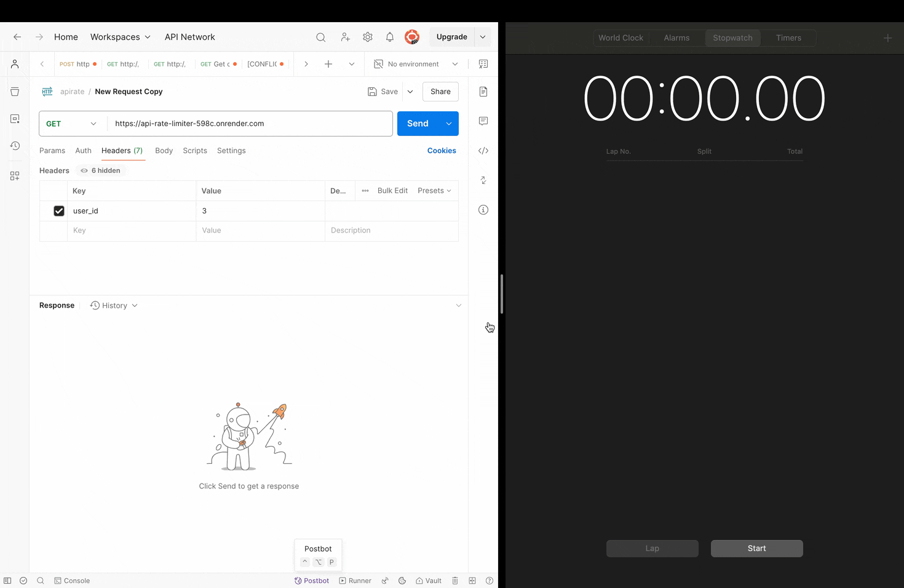

# 🚀 API Rate Limiter Middleware

🎉 Welcome to the **API Rate Limiter Middleware**! This project implements a sliding window rate limiter using **Redis**. The middleware ensures fair usage of your API endpoints by limiting the number of requests a client can make within a specified time period.

---

## 🌐 Live Demo

You can test the live deployed version here:

🔗 [https://api-rate-limiter-598c.onrender.com?user_id=1](https://api-rate-limiter-598c.onrender.com?user_id=1)

Note that we need to pass "user_id" as a key in request header or give it as a query parameter as it is the pivot on which middleware performs checks

---

### 🎥 Demo GIF



---

### 📊 Test Scenario Table

The following table summarizes the test scenario shown in the demo:

| Time (minutes:seconds) | Status         |
|------------------------|----------------|
| 00:00                  | ✅ Accepted    |
| 00:14                  | ✅ Accepted    |
| 00:25                  | ✅ Accepted    |
| 00:37                  | ✅ Accepted    |
| 00:49                  | ✅ Accepted    |
| 00:55                  | ❌ Rejected    |
| 01:02                  | ✅ Accepted    |
| 01:08                  | ❌ Rejected    |
| 01:16                  | ✅ Accepted    |

Above testing has been done for configuration RATELIMIT_DURATION_IN_SECONDS=60 and NUMBER_OF_REQUEST_ALLOWED=5

---

## 🌟 Features

- 🌐 **Cloud-Hosted Redis**: Uses [Redis Cloud](https://cloud.redis.io/) for production-ready deployment.
- ⚡ **Local Redis Support**: Easily switch to a local Redis instance for development.
- 🛠 **Sliding Window Algorithm**: Dynamically manages requests based on time and count.
- 🔧 **Environment Configurable**: Configure rate limits and Redis connection details via environment variables.

---

## 🖥️ How to Use the Middleware

Integrating the middleware into your **Express.js** application is straightforward:

### Example Usage:
```javascript
const express = require("express");
const ratelimiter = require("./rate_limiter");

const app = express();
const PORT = process.env.PORT || 8080;

// Apply the rate limiter middleware
app.use(ratelimiter);

app.get("/", (req, res) => {
    res.status(200).json({ message: `Welcome to API RATE LIMITER` });
});

app.get("/ping", async (req, res) => {
    res.status(200).json({ message: "Pinged to server" });
});

app.listen(PORT, () => {
    console.log(`Server listening on port ${PORT}`);
});
```

---

## 🔧 Configuration

The middleware reads configuration values from the environment variables defined in your `.env` file:

```dotenv
# Redis Configuration
REDIS_HOST=localhost
REDIS_PORT=6379
REDIS_USERNAME= # Leave empty for local Redis
REDIS_PASSWORD= # Leave empty for local Redis

# Rate Limiter Configuration
RATELIMIT_DURATION_IN_SECONDS=60
NUMBER_OF_REQUEST_ALLOWED=5
```

---

## 🚀 Running Locally with Redis

1. **Install Redis**:
   - On macOS:
     ```bash
     brew install redis
     ```
   - On Ubuntu:
     ```bash
     sudo apt update
     sudo apt install redis-server
     ```

2. **Start Redis**:
   ```bash
   redis-server
   ```

3. **Verify Redis is Running**:
   ```bash
   redis-cli ping
   ```
   You should see:
   ```
   PONG
   ```

4. **Run the Application**:
   - Ensure your `.env` file points to the local Redis server:
     ```dotenv
     REDIS_HOST=127.0.0.1
     REDIS_PORT=6379
     REDIS_USERNAME=
     REDIS_PASSWORD=
     ```
   - Start the app:
     ```bash
     node index.js
     ```

5. **Test the Middleware**:
   - Use `curl` or Postman to test:
     ```bash
     curl -H "user_id: test_user" http://localhost:8080/
     ```

---

## 📦 Deployment

This middleware is production-ready and can be deployed using services like **Render**, **Heroku**, or **AWS Elastic Beanstalk**. Ensure that your environment variables are correctly configured for the target environment.

---

## 🌐 API Endpoints

Here are the available endpoints for testing the middleware:

| Method | Endpoint | Description                          |
|--------|----------|--------------------------------------|
| GET    | `/`      | Welcome message                     |
| GET    | `/ping`  | Ping the server to test the limiter |

Note that we need to pass "user_id" as a key in request header which is used by rate-limiter middleware

---

## 🛠 How to Extend

1. **Customizable Rate Limits**:
   - Modify `RATELIMIT_DURATION_IN_SECONDS` and `NUMBER_OF_REQUEST_ALLOWED` in `.env`.

2. **Error Handling**:
   - Customize the error response when requests exceed the limit.

3. **Additional Channels**:
   - Add more user-specific keys (e.g., IP address, API keys) for advanced rate limiting.

---

## 🤝 Contributing

Contributions are welcome! If you find any issues or have suggestions for improvement, feel free to fork this repository and open a pull request.

---

## 🔒 License

This project is licensed under the MIT License. See the [LICENSE](LICENSE) file for more details.

---

## 📬 Contact

For any questions or issues, feel free to open an issue in this repository.

---

🎉 **Thank you for using the API Rate Limiter Middleware! Happy Coding!** 🎉
